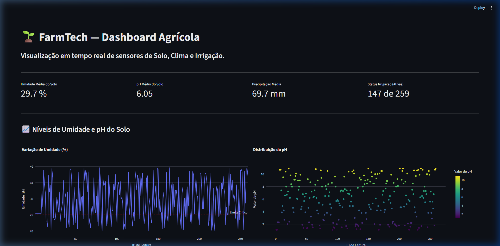

# 🌱 FarmTech Solutions — Dashboard de Monitoramento Agrícola (Fase 3)

Este projeto consiste em um **Dashboard Interativo em Python** desenvolvido para a visualização de dados de sensores agrícolas coletados na **Fase 2 (IoT/Arduino/ESP32)**. O sistema monitora a umidade do solo, pH, macronutrientes (Fósforo e Potássio) e volume de chuva (precipitação), fornecendo insights acionáveis em tempo real e recomendações automáticas de irrigação com base em regras climáticas.

---

## 👥 Integrantes do Grupo

| Nome | RM |
| :--- | :---: |
| Antuny Marques | RM573852 |
| Tiago Gonçalves | RM570935 |
| Carlos Ribeiro | RM571449 |
| Lucas Ribeiro | RM572508 |
| Anderson Sapucaia | RM571668 |

---

## 🖥️ Demonstração da Interface

Abaixo está uma captura de tela do dashboard agrícola em funcionamento, apresentando métricas dinâmicas, gráficos analíticos interativos e a tabela de recomendações automatizadas:



---

## ⚙️ Regra de Negócio: Tomada de Decisão de Irrigação

Para otimizar o uso da água e garantir a saúde da plantação, o dashboard processa os dados climáticos e de solo através de uma **engine de regras condicionais**:

*   **💧 Recomendado Irrigar:** Ativado se a **Umidade do Solo for inferior a 26%** E a **Precipitação prevista/atual for menor que 60mm**.
*   **🌧️ Chuva Suficiente:** Ativado quando a **Precipitação for igual ou superior a 80mm**, indicando que a água da chuva é suficiente para suprir as necessidades hídricas da cultura.
*   **✅ Condição Adequada:** Ativado quando os níveis hídricos e de chuva estão equilibrados, não demandando irrigação artificial imediata.

---

## 📊 Variáveis Monitoradas

O painel analisa e plota 5 variáveis críticas da Fase 2 de forma clara e objetiva:

1.  **Umidade do Solo (%)**: Exibida em cartão de métricas gerais e no gráfico de linha temporal, incluindo uma **linha vermelha pontilhada de limite crítico (25.0%)** para fácil identificação de alertas de seca.
2.  **pH do Solo**: Exibido em métrica média e distribuído em um gráfico de dispersão (*scatter plot*) com escala de cor *Viridis* para avaliar visualmente a acidez do solo.
3.  **Nutrientes (P - Fósforo e K - Potássio)**: Apresentados em um gráfico de barras comparativo que contabiliza as detecções positivas nos sensores de macronutrientes.
4.  **Precipitação (mm)**: Volume médio de chuva registrado pelos sensores.
5.  **Status de Irrigação**: Histórico consolidado em formato de gráfico de pizza, demonstrando a proporção de ativação das bombas de irrigação.

---

## 🛠️ Tecnologias Utilizadas

*   **Python 3** — Linguagem base do sistema.
*   **Streamlit** — Framework moderno para desenvolvimento de aplicativos web de ciência de dados.
*   **Pandas** — Biblioteca robusta para carregamento e manipulação dos dados tabulares.
*   **Plotly Express** — Biblioteca gráfica para gráficos vetoriais altamente interativos (hover, zoom, exportar).

---

## 📁 Estrutura de Arquivos do Projeto

```text
dashboard/
├── Dados_Clima_ESP32.csv    # Conjunto de dados histórico coletado na Fase 2
├── dashboard_agricola.py    # Código-fonte principal em Python (Streamlit)
├── dashboard_main_view.png  # Captura de tela da interface do dashboard
├── requirements.txt         # Arquivo de dependências necessárias
└── README.md                # Documentação técnica do dashboard (este arquivo)
```

---

## 🚀 Como Executar o Dashboard Localmente

Siga os passos abaixo para preparar seu ambiente e rodar o dashboard no seu computador:

### 1. Pré-requisitos
Certifique-se de ter o Python 3 instalado no seu sistema.

### 2. Instalar Dependências
Navegue até a pasta onde os arquivos estão localizados e instale todas as bibliotecas necessárias declaradas no `requirements.txt`:
```bash
pip install -r requirements.txt
```

### 3. Executar o Dashboard
Para inicializar o servidor do Streamlit, execute o comando abaixo no terminal:
```bash
streamlit run dashboard_agricola.py
```

> 💡 *Nota: Se for a primeira execução do Streamlit no seu computador, ele pedirá um e-mail no terminal (`Email:`). Você pode apenas pressionar **Enter** para ignorar e seguir em frente.*

### 4. Acessar o Aplicativo
O Streamlit abrirá automaticamente uma página no seu navegador. Caso não abra por padrão, acesse o endereço abaixo:
```text
http://localhost:8501
```

---

## 🎥 Vídeo Demonstrativo

📺 **[Link para o vídeo no YouTube](https://youtu.be/ykjto4zIzus)**
> O vídeo de até 5 minutos demonstra os gráficos em ação, a interatividade dos filtros da tabela e a explicação técnica detalhada sobre como os dados da Fase 2 de IoT foram integrados e tratados.

---
*FarmTech Solutions — Fase 3 | Faculdade de Tecnologia FIAP*
