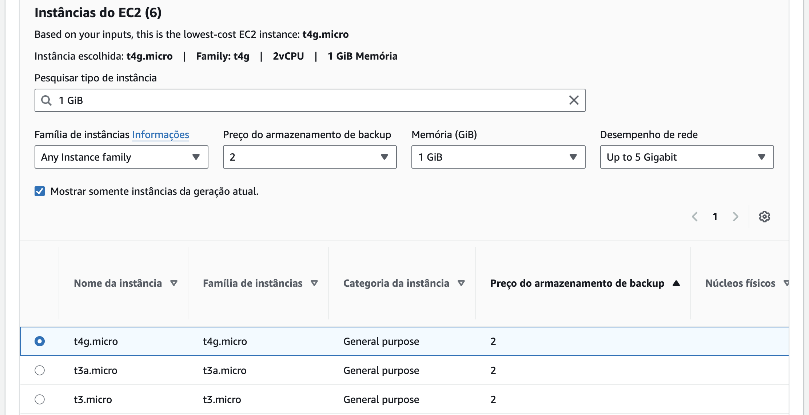
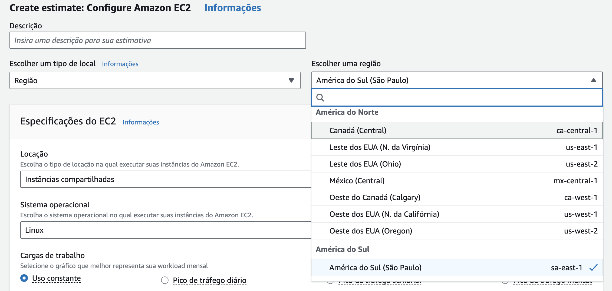
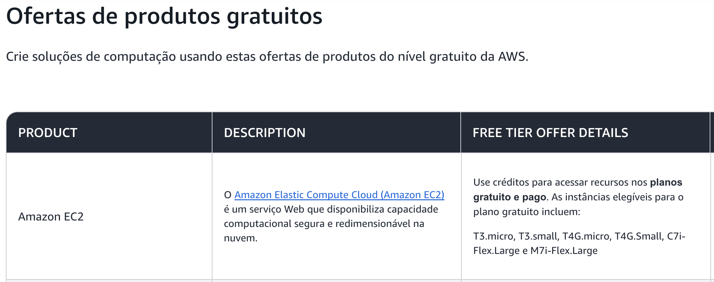

<div align="center">

# 🌱 Machine Learning na Cabeça

### Previsão de Rendimento de Safra + Estimativa de Custos em Nuvem (AWS)


<br>

Projeto da FarmTech Solutions para a disciplina **Fase 5 — Machine Learning na Cabeça**
(FIAP). Duas entregas obrigatórias: previsão de rendimento de safra + clusterização de
tendências de produtividade (Machine Learning), e uma estimativa comparativa de custos
de hospedagem em nuvem (AWS).

</div>

---

## Índice

- [Entrega 1 — Machine Learning](#entrega-1--machine-learning)
- [Entrega 2 — Computação em Nuvem (AWS)](#entrega-2--computação-em-nuvem-aws)
- [Ir Além (opcional)](#ir-além-opcional)
- [Instalação e Execução](#instalação-e-execução)
- [Estrutura desta Atividade](#estrutura-desta-atividade)
- [Autores](#autores)

---

## Entrega 1 — Machine Learning

Toda a análise (exploração dos dados, clusterização/detecção de outliers e os 5
modelos preditivos de rendimento) está documentada, com código comentado e discussão
textual dos resultados, **dentro do notebook Jupyter** — não repetimos o conteúdo aqui,
para evitar duplicação.

- 📓 **Notebook:** [`AntunyMarques_rm573852_pbl_fase5.ipynb`](./AntunyMarques_rm573852_pbl_fase5.ipynb)
- 🎥 **Vídeo demonstrativo (não listado):** [youtu.be/-qpAL5P7Pv4](https://youtu.be/-qpAL5P7Pv4)
- 📊 **Base de dados:** [`data/crop_yield.csv`](./data/crop_yield.csv) — fornecida pela FIAP (Capítulo 10)

**Resumo do que o notebook cobre** (detalhes, gráficos e discussão completa no
próprio Jupyter):
1. Análise exploratória (EDA) — distribuições, correlação global vs. por cultura, e um
   achado relevante sobre a unidade real da coluna de rendimento (hg/ha, não t/ha);
2. Detecção de outliers com duas técnicas independentes (IQR por cultura + Isolation Forest);
3. Clusterização (K-Means + PCA + DBSCAN) para encontrar tendências de produtividade;
4. Cinco algoritmos de regressão distintos (Regressão Linear, Árvore de Decisão, Random
   Forest, Gradient Boosting e SVR), comparados com métricas de erro e validação cruzada;
5. Conclusão com pontos fortes e limitações do trabalho.

---

## Entrega 2 — Computação em Nuvem (AWS)

**Cenário:** hospedar uma API que recebe os dados dos sensores (Entrega 1) e roda o
modelo de Machine Learning, em uma máquina Linux simples com:

| Requisito | Valor |
|---|---|
| CPU | 2 vCPUs |
| Memória | 1 GiB |
| Rede | Até 5 Gigabit |
| Armazenamento | 50 GB (HD/SSD) |
| Tipo de cotação | On-Demand — 100% |

Utilizamos a [calculadora pública de estimativa de custos da AWS](https://calculator.aws)
(*Create estimate*) para simular os dois cenários possíveis — São Paulo e N. Virginia —
com essa configuração.

### 1. Escolha da instância e da região

Buscando a solução mais econômica que atendesse aos 4 requisitos, a própria calculadora
aponta a `t4g.micro` (processador AWS Graviton2, arquitetura ARM) como a instância de
menor custo disponível para "2 vCPU, 1 GiB de Memória, Até 5 Gigabit de rede":



Para o armazenamento, optamos pelo **Amazon EBS gp3** (50 GB), que oferece a melhor
relação custo-benefício, com 3.000 IOPS e 125 MB/s de taxa de transferência inclusos na
faixa de preço base.

Apesar de existir a opção de preço mais baixo nos EUA, a região foi decidida por
critérios que vão além do custo (ver seção 2) — optamos pela **América do Sul (São
Paulo)**:



**📊 Comparativo mensal (estimativa na AWS Pricing Calculator, On-Demand, Linux):**

| Recurso AWS | 🇺🇸 us-east-1 (N. Virginia) | 🇧🇷 sa-east-1 (São Paulo) |
|---|---|---|
| Compute (EC2 `t4g.micro`) | ~US$ 6,13/mês | ~US$ 9,49/mês |
| Storage (50 GB EBS `gp3`) | ~US$ 4,00/mês | ~US$ 5,53/mês |
| **Custo total estimado** | **~US$ 10,13/mês** | **~US$ 15,02/mês** |


*(Custos de transferência de dados de saída não estão inclusos, pois dependem do volume
de tráfego da API e, a princípio, não ultrapassam o limite do Free Tier.)*

> 🔁 **Reproduza você mesmo na calculadora oficial** (para o print/vídeo da entrega):
> 1. Acesse a [AWS Pricing Calculator](https://calculator.aws) → *Create estimate* → *Amazon EC2*.
> 2. Sistema operacional: **Linux**. Cotação: **On-Demand**.
> 3. Em "Memória (GiB)": `1 GiB`, em "Desempenho de rede": `Up to 5 Gigabit` — selecione `t4g.micro`.
> 4. Storage: adicione um volume **EBS gp3 de 50 GB**.
> 5. Troque a região no topo da página entre **América do Sul (São Paulo)** e **Leste dos EUA (N. da Virgínia)** e compare o total mensal exibido.

**💡 Free Tier:** a `t4g.micro` também está incluída no nível gratuito da AWS — até 750
horas mensais sem custo, um incentivo a mais para validar o modelo em produção antes de
escalar:



### 2. Qual região escolher, considerando acesso rápido aos dados e restrições legais?

Apesar de a região de N. Virginia apresentar um custo ~30-35% menor, a **recomendação
para este cenário é hospedar em São Paulo (sa-east-1)**. Justificativa:

- **⚡ Baixa latência / acesso rápido aos dados:** os sensores instalados na fazenda e no
  maquinário agrícola enviam fluxos contínuos de dados (telemetria, clima local, estado
  do solo). Uma rota até `us-east-1` (N. Virginia) tem latência média de **110 a 150 ms**;
  até `sa-east-1` (São Paulo), de **10 a 30 ms**. Para que o modelo preditivo da Entrega 1
  atue quase em tempo real — alertando o produtor antes que uma condição de risco se
  agrave —, essa diferença de ~100 ms é relevante.
- **🛡️ Soberania de dados e conformidade legal (LGPD):** o sistema lida com geolocalização
  exata das propriedades rurais atendidas, dados contratuais dos produtores e padrões
  operacionais das máquinas — informações potencialmente sensíveis. A Lei Geral de
  Proteção de Dados (Lei nº 13.709/2018) impõe regras específicas para **transferência
  internacional de dados** (Art. 33), e contratos do agronegócio brasileiro
  frequentemente exigem ou recomendam que dados de clientes nacionais não cruzem
  fronteiras. Manter a infraestrutura em território nacional elimina essa discussão
  jurídica e mitiga riscos de auditoria.
- **Custo/benefício:** o investimento adicional de ~US$ 5/mês compensa amplamente o
  ganho em segurança jurídica e em desempenho da aplicação — a decisão não é "a mais
  barata no papel", e sim a mais adequada ao conjunto de requisitos do problema.

**Conclusão:** a instância mais barata em termos absolutos é a `t4g.micro` em
**N. Virginia** (~US$ 10,13/mês) — resposta à pergunta 1, sem outras restrições. Já a
pergunta 2 muda o cálculo: com exigência de acesso rápido aos dados dos sensores e
restrição legal de armazenamento no exterior, a escolha correta é `t4g.micro`
**em São Paulo (sa-east-1)** (~US$ 15,02/mês).

- 🎥 **Vídeo demonstrativo (não listado):** [youtu.be/xuF_gcdwmhM](https://youtu.be/xuF_gcdwmhM)

---

## Ir Além (opcional)

Os desafios bônus "Ir Além" (ESP32 + sensores, ou ESP32 + classificação de saúde da
plantação via ML) **não valem nota** e não foram desenvolvidos nesta entrega.

---

## Instalação e Execução

```bash
pip install -r requirements.txt
jupyter notebook AntunyMarques_rm573852_pbl_fase5.ipynb
# No Jupyter: Kernel -> Restart & Run All
```

---

## Estrutura desta Atividade

```
Fase_05/Atv_01/
├── README.md                                   (este arquivo)
├── requirements.txt
├── AntunyMarques_rm573852_pbl_fase5.ipynb      # Entrega 1 — notebook completo
├── data/
│   └── crop_yield.csv                          # base de dados oficial (FIAP, Cap. 10)
└── imagens/
    └── aws_custo_comparativo.png               # gráfico usado na Entrega 2
```

---

## Autores

<div align="center">

| Integrante | RM |
|:---|:---:|
| **Antuny Marques** | `RM573852` |
| **Tiago Gonçalves** | `RM570935` |
| **Carlos Ribeiro** | `RM571449` |
| **Lucas Ribeiro** | `RM572508` |
| **Anderson Sapucaia** | `RM571668` |

</div>
