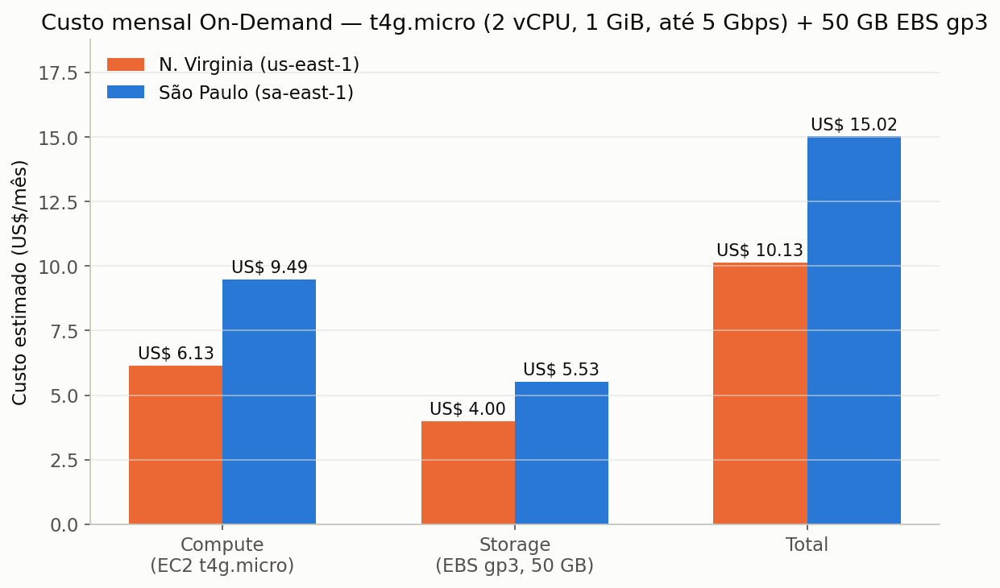

<div align="center">

# 🌱 Machine Learning na Cabeça

### Previsão de Rendimento de Safra + Estimativa de Custos em Nuvem (AWS)


<br>

Projeto da FarmTech Solutions para a disciplina **Fase 5 — Machine Learning na Cabeça**
(FIAP). Duas entregas obrigatórias: previsão de rendimento de safra + clusterização de
tendências de produtividade (Machine Learning), e uma estimativa comparativa de custos
de hospedagem em nuvem (AWS).

</div>

---

## Índice

- [Entrega 1 — Machine Learning](#entrega-1--machine-learning)
- [Entrega 2 — Computação em Nuvem (AWS)](#entrega-2--computação-em-nuvem-aws)
- [Ir Além (opcional)](#ir-além-opcional)
- [Instalação e Execução](#instalação-e-execução)
- [Estrutura desta Atividade](#estrutura-desta-atividade)
- [Autores](#autores)

---

## Entrega 1 — Machine Learning

Toda a análise (exploração dos dados, clusterização/detecção de outliers e os 5
modelos preditivos de rendimento) está documentada, com código comentado e discussão
textual dos resultados, **dentro do notebook Jupyter** — não repetimos o conteúdo aqui,
para evitar duplicação.

- 📓 **Notebook:** [`AntunyMarques_rm573852_pbl_fase5.ipynb`](./AntunyMarques_rm573852_pbl_fase5.ipynb)
- 🎥 **Vídeo demonstrativo (não listado):** [youtu.be/-qpAL5P7Pv4](https://youtu.be/-qpAL5P7Pv4)
- 📊 **Base de dados:** [`data/crop_yield.csv`](./data/crop_yield.csv) — fornecida pela FIAP (Capítulo 10)

**Resumo do que o notebook cobre** (detalhes, gráficos e discussão completa no
próprio Jupyter):
1. Análise exploratória (EDA) — distribuições, correlação global vs. por cultura, e um
   achado relevante sobre a unidade real da coluna de rendimento (hg/ha, não t/ha);
2. Detecção de outliers com duas técnicas independentes (IQR por cultura + Isolation Forest);
3. Clusterização (K-Means + PCA + DBSCAN) para encontrar tendências de produtividade;
4. Cinco algoritmos de regressão distintos (Regressão Linear, Árvore de Decisão, Random
   Forest, Gradient Boosting e SVR), comparados com métricas de erro e validação cruzada;
5. Conclusão com pontos fortes e limitações do trabalho.

---

## Entrega 2 — Computação em Nuvem (AWS)

**Cenário:** hospedar uma API que recebe os dados dos sensores (Entrega 1) e roda o
modelo de Machine Learning, em uma máquina Linux simples com:

| Requisito | Valor |
|---|---|
| CPU | 2 vCPUs |
| Memória | 1 GiB |
| Rede | Até 5 Gigabit |
| Armazenamento | 50 GB (HD/SSD) |
| Tipo de cotação | On-Demand — 100% |

### 1. Comparação de custos: São Paulo (sa-east-1) x N. Virginia (us-east-1)

Duas famílias de instância EC2 atendem exatamente essas 4 especificações — **2 vCPUs,
1 GiB de RAM e rede "Até 5 Gigabit"** — no catálogo da AWS: `t3.micro` (x86) e
`t4g.micro` (ARM/Graviton, mais barata para a mesma configuração). O `t2.micro`
(frequentemente lembrado por ser o de "camada gratuita") **não atende ao requisito de
rede** (é classificado como "Baixo a Moderado", não "Até 5 Gigabit"), por isso não foi
considerado.

Valores **On-Demand, Linux**, cotados na calculadora de preços da AWS (Price List API)
em 07/09/2026:

| Instância | vCPU | RAM | Rede | São Paulo (sa-east-1) | N. Virginia (us-east-1) |
|---|---|---|---|---|---|
| `t3.micro` | 2 | 1 GiB | Até 5 Gbps | US$ 0,0168/h (≈ US$ 12,26/mês) | US$ 0,0104/h (≈ US$ 7,59/mês) |
| `t4g.micro` | 2 | 1 GiB | Até 5 Gbps | US$ 0,0134/h (≈ US$ 9,78/mês) | US$ 0,0084/h (≈ US$ 6,13/mês) |

Armazenamento **EBS gp3, 50 GB**:

| Região | US$/GB-mês | 50 GB/mês |
|---|---|---|
| São Paulo (sa-east-1) | US$ 0,152 | US$ 7,60 |
| N. Virginia (us-east-1) | US$ 0,08 | US$ 4,00 |

**Custo total mensal estimado** (instância 24×7 + 50 GB de armazenamento):



| Configuração | São Paulo | N. Virginia | Diferença |
|---|---|---|---|
| `t3.micro` + 50 GB gp3 | US$ 19,86/mês | US$ 11,59/mês | São Paulo é **+71%** mais cara |
| `t4g.micro` + 50 GB gp3 | US$ 17,38/mês | US$ 10,13/mês | São Paulo é **+72%** mais cara |

**Solução mais barata:** `t4g.micro` em **N. Virginia (us-east-1)**, a ~US$ 10,13/mês —
a opção Graviton (ARM) é a mais econômica em ambas as regiões, e N. Virginia é
sistematicamente mais barata que São Paulo para a mesma configuração (a AWS tem mais
capacidade instalada e concorrência de datacenters na região histórica dos EUA, o que
pressiona os preços para baixo).

> 🔁 **Reproduza você mesmo na calculadora oficial** (para o print/vídeo da entrega):
> 1. Acesse a [AWS Pricing Calculator](https://calculator.aws) → *Create estimate* → *Amazon EC2*.
> 2. Sistema operacional: **Linux**. Cotação: **On-Demand**.
> 3. Em "Number of instances": `1`. Em "vCPUs": filtre por `2`, em "Memory": `1 GiB` — selecione `t3.micro` (e repita para `t4g.micro`).
> 4. Storage: adicione um volume **EBS gp3 de 50 GB**.
> 5. Troque a região no topo da página entre **South America (São Paulo)** e **US East (N. Virginia)** e compare o total mensal exibido.

### 2. Qual região escolher, considerando acesso rápido aos dados e restrições legais?

Apesar de N. Virginia ser ~70% mais barata, a **recomendação para este cenário é
hospedar em São Paulo (sa-east-1)**. Justificativa:

- **Restrições legais (LGPD):** a Lei Geral de Proteção de Dados (Lei nº 13.709/2018)
  impõe regras específicas para **transferência internacional de dados** (Art. 33) quando
  os dados envolvem informações de uma pessoa natural identificável. Os dados de sensores
  em si (clima/solo) tendem a ser dados não-pessoais, mas, na prática, um sistema de
  monitoramento de fazenda normalmente também guarda dados do produtor rural, contratos e
  geolocalização de propriedade privada — o que pode caracterizar dado pessoal. **Manter
  a infraestrutura em território nacional (sa-east-1) elimina totalmente essa discussão
  jurídica**, evitando o custo/risco de análise de conformidade para transferência
  internacional, cláusulas contratuais específicas, ou eventual exigência contratual do
  cliente (comum em contratos do agronegócio brasileiro) de que os dados não saiam do país.
- **Latência / acesso rápido aos dados:** a fazenda e seus sensores estão no Brasil. A
  distância física até `sa-east-1` (São Paulo) é uma fração da distância até
  `us-east-1` (Virgínia, EUA) — na prática, isso normalmente significa uma latência de
  ida-e-volta de dezenas de milissegundos para o Brasil, contra mais de cem
  milissegundos para os EUA. Para uma API que recebe leituras de sensores continuamente e
  precisa responder rápido (ex.: alertas quase em tempo real), essa diferença é
  perceptível e relevante.
- **Custo/benefício:** o adicional de ~US$ 7-8/mês (diferença entre as regiões) é um
  valor baixo em termos absolutos para uma carga de trabalho desse porte, e é um preço
  razoável a pagar para eliminar risco legal e reduzir latência — a decisão não é "a
  mais barata no papel", e sim a mais adequada ao conjunto de requisitos do problema.

**Conclusão:** a instância mais barata (`t4g.micro` em N. Virginia) responde à
pergunta 1 (menor custo, sem outras restrições); já a pergunta 2 muda o cálculo — com
exigência de acesso rápido e restrição legal de armazenamento no exterior, a escolha
correta é `t4g.micro` (ou `t3.micro`) **em São Paulo (sa-east-1)**.

- 🎥 **Vídeo demonstrativo (não listado, até 5 min):** `[LINK DO YOUTUBE]`

---

## Ir Além (opcional)

Os desafios bônus "Ir Além" (ESP32 + sensores, ou ESP32 + classificação de saúde da
plantação via ML) **não valem nota** e não foram desenvolvidos nesta entrega.

---

## Instalação e Execução

```bash
pip install -r requirements.txt
jupyter notebook AntunyMarques_rm573852_pbl_fase5.ipynb
# No Jupyter: Kernel -> Restart & Run All
```

---

## Estrutura desta Atividade

```
Fase_05/Atv_01/
├── README.md                                   (este arquivo)
├── requirements.txt
├── AntunyMarques_rm573852_pbl_fase5.ipynb      # Entrega 1 — notebook completo
├── data/
│   └── crop_yield.csv                          # base de dados oficial (FIAP, Cap. 10)
└── imagens/
    └── aws_custo_comparativo.png               # gráfico usado na Entrega 2
```

---

## Autores

<div align="center">

| Integrante | RM |
|:---|:---:|
| **Antuny Marques** | `RM573852` |
| **Tiago Gonçalves** | `RM570935` |
| **Carlos Ribeiro** | `RM571449` |
| **Lucas Ribeiro** | `RM572508` |
| **Anderson Sapucaia** | `RM571668` |

</div>
